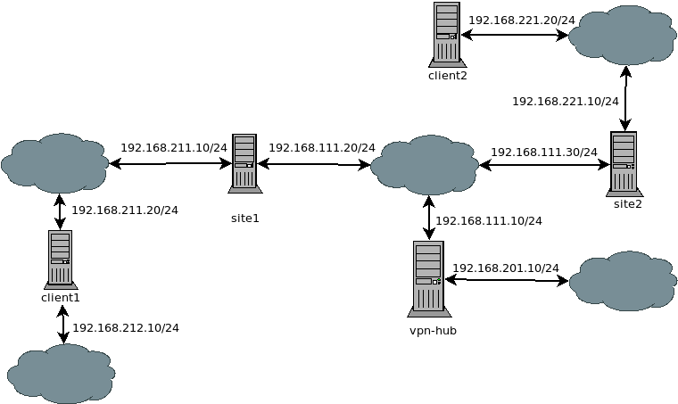

# ospf-over-openvpn

Base on https://www.unixadm.org/needful-things/openvpn-ospf. Point is connect
multiple localization over openvpn and use ospf (bird) for detect new network.
In scenario only 1 point use public adres IP and it will be openvpn hub. 
I will try to create openvpn client with bird but only as "endpoint" client
without passing traffic. More generic and autodetec configuration then better :) 

## Network Schema

It use tap and broadcast.

To do:
use tun and ptmp ospf connection
